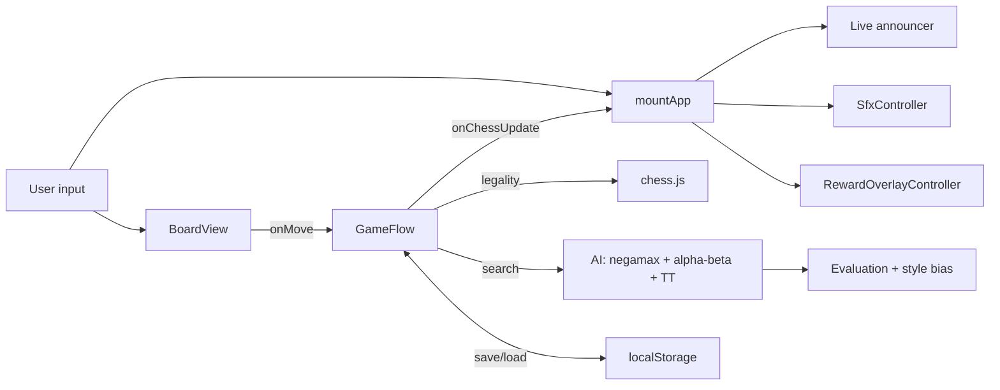

# The Calculus of Kings

> An alt-history chess RPG. Play it in your browser, install it on iPhone, or run it locally.

<p align="center">
  <a href="https://sauterreed24.github.io/Chess-of-Kings/">
    
  </a>
</p>

<p align="center">
  <a href="https://sauterreed24.github.io/Chess-of-Kings/"></a>
  <a href="LICENSE"></a>
  <a href="https://github.com/sauterreed24/Chess-of-Kings/releases"></a>
</p>

<p align="center">
  <a href="https://github.com/sauterreed24/Chess-of-Kings/actions/workflows/ci.yml"></a>
  &nbsp;
  <a href="https://github.com/sauterreed24/Chess-of-Kings/actions/workflows/pages.yml"></a>
</p>

<p align="center">
  <a href="https://sauterreed24.github.io/Chess-of-Kings/"><b>https://sauterreed24.github.io/Chess-of-Kings/</b></a>
  &nbsp;·&nbsp;
  <a href="#start-here">Start here</a>
  &nbsp;·&nbsp;
  <a href="#at-a-glance-recruiters">At a glance</a>
  &nbsp;·&nbsp;
  <a href="#thirty-second-tour">30‑second tour</a>
  &nbsp;·&nbsp;
  <a href="#for-engineers">Engineering</a>
  &nbsp;·&nbsp;
  <a href="#for-reviewers">Hiring / AI</a>
  &nbsp;·&nbsp;
  <a href="#run-locally">Local run</a>
</p>

---

<span id="at-a-glance-recruiters"></span>

## At a glance (recruiters & screeners)

| | |
| --- | --- |
| **What it is** | Story-driven chess RPG with adaptive rival AI, shipped as a **static PWA** (no backend, no accounts). |
| **Play** | **[Live demo](https://sauterreed24.github.io/Chess-of-Kings/)** — first step is always [Start here](#start-here). |
| **Stack** | **TypeScript (strict)**, plain DOM, **Vite**, **Vitest**, `chess.js`; Capacitor shells for optional native builds. |
| **Quality** | **763** automated tests, ESLint **0** warnings, CI on every PR (`quality:gate`: lint, typecheck, deterministic tests, UI smoke, build, pages-build assertions, bundle gzip report). Optional Playwright smoke job on `main`. |
| **Fit signals** | Accessibility-minded UI, save-format migrations, property-tested engine, small **gzip** JS budget (<99 KB). |
| **Author** | **Reed Sauter** — [GitHub](https://github.com/sauterreed24) · [LinkedIn](https://www.linkedin.com/in/reed-sauter-205774208) |
| **Core skills** | TypeScript · Vite · game development · chess engine / game AI · accessibility (ARIA, keyboard UI) · Vitest & property-based testing · PWA · client persistence · CI release gates · technical writing |


**Suggested GitHub topics** (for discoverability): `typescript`, `vite`, `vitest`, `pwa`, `chess`, `game-development`, `accessibility`, `github-pages`, `no-framework`.

---

<span id="start-here"></span>

## Start here (play in 30 seconds)

**You do not need to clone the repo to play.** The game is the live site only.

1. Open **[the live demo](https://sauterreed24.github.io/Chess-of-Kings/)** (or paste `https://sauterreed24.github.io/Chess-of-Kings/` into any modern browser).
2. Wait until the brass “Loading the archive…” plate is replaced by the title screen (first load may take a few seconds on slow networks).
3. Tap **Enter the Archive** (no save yet) or **Resume expedition** (returning player).
4. Use **Chapters** in the top bar, pick an open chapter, then follow **Advance** through the story until the board appears.

**Requirements:** JavaScript enabled (the game is a client-side app). Works in current Chrome, Firefox, Safari, and Edge. **Private/incognito** is fine; you will not have a prior save.

**iPhone / in-app browsers (Messages, Mail, LinkedIn, etc.):** for the full UI (not plain default fonts), open the link in **Safari** using **Open in Safari** if another app embeds a stripped-down WebView. The deployed site sets a **`<base href>`** so icons, manifest, stylesheet, and script always resolve under `/Chess-of-Kings/` even when the WebView’s URL bar omits a trailing slash.

**If you only see “Loading the archive…”:** hard-refresh the tab (Windows: `Ctrl+Shift+R`, Mac: `Cmd+Shift+R`), try a private window, or temporarily disable strict ad/script blockers for `github.io`. If the network blocks `github.io`, use **Run locally** below — that does not need GitHub Pages.

**If you forked this repo:** your Pages URL is `https://<your-username>.github.io/<repository-name>/` (the path segment matches the repository name). Enable **Settings → Pages → Source: GitHub Actions** and ensure the **Deploy GitHub Pages** workflow has run on `main` (see [`.github/workflows/pages.yml`](./.github/workflows/pages.yml)).

<span id="pwa-stale-cache"></span>

**After a new release (stale PWA / service worker):** the app shell is cached for offline use ([`public/sw.js`](./public/sw.js); cache version bumps on releases). If you still see an **old build** right after a deploy, **hard-refresh** once (`Ctrl+Shift+R` / `Cmd+Shift+R`) or clear site data for `github.io` (Chrome: padlock → **Site settings** → **Delete data**). A normal refresh usually picks up the new `index.html` on the next visit.

---

<a id="thirty-second-tour"></a>
## 30‑second tour

1. Open **<https://sauterreed24.github.io/Chess-of-Kings/>** on any modern device — phone, tablet, laptop.
2. First-time visitors see **Enter the Archive**; returning visitors see **Resume expedition**.
3. Pick a chapter from the chronicle index, then play through dialogue → drill → rated match against a curated rival.
4. Win or lose, the **Reward overlay** explains *why* — style grade, turning point, training focus, and any unlocks.
5. Press **`?`** anywhere outside a form to see every keyboard shortcut on a parchment-styled atlas.

No sign-up. No tracking. No backend. The whole save lives in `localStorage`.

---

## Live demo

| Device | How to play |
| --- | --- |
| **Any browser** (desktop / laptop / tablet / phone) | Open **<https://sauterreed24.github.io/Chess-of-Kings/>** — that's it. |
| **iPhone / iPad** (installable PWA) | Prefer **Safari** (full engine). Open the link → **Share** → **Add to Home Screen**. In embedded in-app browsers, use **Open in Safari** if the layout looks unstyled. Tested on iPhone 13 Pro Max. |
| **Android** (installable PWA) | Open the link in **Chrome** → tap the **⋮** menu → **Install app** (or **Add to Home Screen**). |
| **Local clone** | See [Run locally](#run-locally) (Node **20.19+**, `npm install`, `npm run dev`). |

The demo is a **single static bundle** served from GitHub Pages. There is no server, no auth, no analytics — every keystroke stays on your device. If a slow network momentarily fails, the service worker keeps the app shell available offline after the first visit. If a deploy looks “stuck” on an old version, see [PWA cache / new releases](#pwa-stale-cache).

---

## What's new in this release (v0.5.69)

**Pass 77 — Chapter VI phone lab** — the Silicon Threshold drills now prove on a 390×844 instrument with 44px Hint|Prove hit targets. See [`docs/PASS77_PHONE_CH6_LAB.md`](docs/PASS77_PHONE_CH6_LAB.md).

## Previous release (v0.5.68)

**Pass 76 — Chapter VII phone lab** — the Human Synthesis drills now prove on a 390×844 instrument: manuscript hidden, Prove docked beside Hint, no turn-pulse wait. See [`docs/PASS76_PHONE_CH7_LAB.md`](docs/PASS76_PHONE_CH7_LAB.md).

## Previous release (v0.5.67)

**Pass 75 — Chapter VIII phone lab** — the Alexandrine Board drills now prove on a 390×844 instrument: manuscript hidden, Prove docked beside Hint, no turn-pulse wait. See [`docs/PASS75_PHONE_CH8_LAB.md`](docs/PASS75_PHONE_CH8_LAB.md).

## Previous release (v0.5.66)

**Pass 74 — Chapter IX phone lab** — the Apotheosis Engine drills now prove on a 390×844 instrument: manuscript hidden, Prove docked beside Hint, no turn-pulse wait. See [`docs/PASS74_PHONE_CH9_LAB.md`](docs/PASS74_PHONE_CH9_LAB.md).

## Previous release (v0.5.65)

**Pass 73 — Knight horse head** — ivory and lapis knights are a carved horse silhouette, not a Wikipedia scribble with an eye on the snout. See [`docs/PASS73_KNIGHT_HEAD.md`](docs/PASS73_KNIGHT_HEAD.md).

## Previous release (v0.5.64)

**Pass 72 — Chapter IX playable** — The Apotheosis Engine is a full campaign age after the Alexandrine Board: habit census, compiled schools, Wren, and Bram. The compiled campaign now ends at a mastery plateau, not a teaser. See [`docs/PASS72_CHAPTER_IX.md`](docs/PASS72_CHAPTER_IX.md).

## Previous release (v0.5.63)

**Pass 71 — Chapter VIII playable** — The Alexandrine Board is a full campaign age after the Human Synthesis: sovereign exchange, temporal forks, Voss, and Elara. See [`docs/PASS71_CHAPTER_VIII.md`](docs/PASS71_CHAPTER_VIII.md).

## Previous release (v0.5.62)

**Pass 70 — Chapter VII playable** — The Human Synthesis is a full campaign age after the Silicon Threshold: school switches, safer-wing castling, Mira, and Soren. See [`docs/PASS70_CHAPTER_VII.md`](docs/PASS70_CHAPTER_VII.md).

## Previous release (v0.5.61)

**Pass 69 — Chapter VI playable** — The Silicon Threshold is a full campaign age after the Machine of Discipline: outposts, hanging captures, Prax, and Iota. See [`docs/PASS69_CHAPTER_VI.md`](docs/PASS69_CHAPTER_VI.md).

## Previous release (v0.5.60)

**Pass 68 — Chapter V playable** — The Machine of Discipline is a full campaign age after the Paradox Masters: luft, conversion, Gage, and Helia. See [`docs/PASS68_CHAPTER_V.md`](docs/PASS68_CHAPTER_V.md).

## Previous release (v0.5.59)

**Pass 67 — Square lamp facets** — every marble and lapis square gets a carved lamp and shade, instead of a pillow balloon. See [`docs/PASS67_SQUARE_FACET.md`](docs/PASS67_SQUARE_FACET.md).

## Previous release (v0.5.58)

**Pass 66 — Queen coronet cup** — ivory and lapis queens get a deeper lathe bowl under the pearls, instead of a 3.6px dish. See [`docs/PASS66_QUEEN_BOWL.md`](docs/PASS66_QUEEN_BOWL.md).

## Previous release (v0.5.57)

**Pass 65 — King crown cup** — ivory and lapis kings get a deeper lathe bowl under the plus, instead of a 3.2px dish. See [`docs/PASS65_KING_BOWL.md`](docs/PASS65_KING_BOWL.md).

## Previous release (v0.5.56)

**Pass 64 — Knight eye** — ivory and lapis knights get a carved eye, so the horse head reads on a phone square. See [`docs/PASS64_KNIGHT_EYE.md`](docs/PASS64_KNIGHT_EYE.md).

## Previous release (v0.5.55)

**Pass 63 — Rook battlement cup** — ivory and lapis rooks get a deeper lathe bowl in the battlement, instead of a 2.4px dish. See [`docs/PASS63_ROOK_CUP.md`](docs/PASS63_ROOK_CUP.md).

## Previous release (v0.5.54)

**Pass 62 — Pawn spark** — ivory and lapis pawns get a larger globe spark, instead of a 1.8px speck. See [`docs/PASS62_PAWN_SPARK.md`](docs/PASS62_PAWN_SPARK.md).

## Previous release (v0.5.53)

**Pass 61 — Foot ferrule band** — ivory and lapis pieces get a thicker gold/lapis band at the foot, instead of a 1.4px hairline. See [`docs/PASS61_FERRULE_BAND.md`](docs/PASS61_FERRULE_BAND.md).

## Previous release (v0.5.52)

**Pass 60 — King cross bar** — ivory and lapis kings get a thicker plus on the crown, instead of a 2px scratch. See [`docs/PASS60_CROSS_BAR.md`](docs/PASS60_CROSS_BAR.md).

## Previous release (v0.5.51)

**Pass 59 — Bishop mitre bar** — ivory and lapis bishops get a thicker cleft crossbar, instead of a 1.7px scratch. See [`docs/PASS59_MITRE_BAR.md`](docs/PASS59_MITRE_BAR.md).

## Previous release (v0.5.50)

**Pass 58 — Rook merlon wells** — ivory and lapis rooks get deeper crenel wells, instead of a 1.8px roof scratch. See [`docs/PASS58_ROOK_MERLON.md`](docs/PASS58_ROOK_MERLON.md).

## Previous release (v0.5.49)

**Pass 57 — Bishop mitre cleft** — ivory and lapis bishops get a thicker mitre cut, instead of a 0.9px hairline. See [`docs/PASS57_BISHOP_MITRE.md`](docs/PASS57_BISHOP_MITRE.md).

## Previous release (v0.5.48)

**Pass 56 — King cross inlay** — ivory and lapis kings get a thicker gold/lapis plus on the crown, instead of a 1.4px hairline. See [`docs/PASS56_KING_INLAY.md`](docs/PASS56_KING_INLAY.md).

## Previous release (v0.5.47)

**Pass 55 — Queen coronet pearls** — ivory and lapis queens get readable coronet catch-lights on the first board, instead of 2.8px specks. See [`docs/PASS55_QUEEN_PEARL.md`](docs/PASS55_QUEEN_PEARL.md).

## Previous release (v0.5.46)

**Pass 54 — Wide calibration Hint** — a spent Hint stays hidden when a phone calibration lab widens after the Archive replies. See [`docs/PASS54_WIDE_CAL_HINT.md`](docs/PASS54_WIDE_CAL_HINT.md).

## Previous release (v0.5.45)

**Pass 53 — Pawn globe catch-light** — ivory and lapis pawns get a readable globe bloom and spark on the first board, instead of a 2px speck. See [`docs/PASS53_PAWN_GLOBE.md`](docs/PASS53_PAWN_GLOBE.md).

## Previous release (v0.5.44)

**Pass 52 — Quiet calibration chrome** — the opening board keeps Archive-reply pulse and auto-coach off the marble, and phone calibration parks Prove beside Reset after the first ply. See [`docs/PASS52_QUIET_CAL_CHROME.md`](docs/PASS52_QUIET_CAL_CHROME.md).

## Previous release (v0.5.40)

**Pass 48 — Quiet puzzle coach** — hanging-knight capture no longer prints Material won under the marble seal. See [`docs/PASS48_QUIET_PUZZLE_COACH.md`](docs/PASS48_QUIET_PUZZLE_COACH.md).

## Previous release (v0.5.39)

**Pass 47 — Quiet puzzle draw** — hanging-knight capture no longer unhides a Draw. pill over the marble seal. See [`docs/PASS47_QUIET_PUZZLE_DRAW.md`](docs/PASS47_QUIET_PUZZLE_DRAW.md).

## Previous release (v0.5.38)

**Pass 46 — Phone puzzle Prove dock** — hanging-knight phones hide the empty tutorial card and dock Prove beside Hint. See [`docs/PASS46_PHONE_PROVE_DOCK.md`](docs/PASS46_PHONE_PROVE_DOCK.md).

## Previous release (v0.5.37)

**Pass 45 — King cross inlay** — ivory and lapis kings get a gold/lapis cross so the hanging-knight king is not a blank crown. See [`docs/PASS45_KING_CROSS.md`](docs/PASS45_KING_CROSS.md).

## Previous release (v0.5.36)

**Pass 44 — Bishop mitre cleft** — ivory and lapis bishops get a carved mitre cleft so the hanging-knight bishop is not a smooth blob. See [`docs/PASS44_BISHOP_CLEFT.md`](docs/PASS44_BISHOP_CLEFT.md).

## Previous release (v0.5.35)

**Pass 43 — Phone puzzle manuscript body** — hanging-knight phones hide the empty manuscript body and the desktop keyboard hint so Prove sits under the title. See [`docs/PASS43_PHONE_PUZZLE_BODY.md`](docs/PASS43_PHONE_PUZZLE_BODY.md).

## Previous release (v0.5.34)

**Pass 42 — Coronet pearls and rook merlons** — ivory and lapis queens get coronet catch-lights; rooks get carved battlement wells. See [`docs/PASS42_CORONET_MERLON.md`](docs/PASS42_CORONET_MERLON.md).

## Previous release (v0.5.33)

**Pass 41 — Phone puzzle lesson-lead** — hanging-knight phones hide the lesson-lead paragraph that duplicates the marble command. See [`docs/PASS41_PHONE_LESSON_LEAD.md`](docs/PASS41_PHONE_LESSON_LEAD.md).

## Previous release (v0.5.32)

**Pass 40 — Phone puzzle story-beat** — hanging-knight phones hide the FIRST LESSON box so the lesson lead is the only manuscript copy. See [`docs/PASS40_PHONE_STORY_BEAT.md`](docs/PASS40_PHONE_STORY_BEAT.md).

## Previous release (v0.5.31)

**Pass 39 — Phone puzzle lesson** — hanging-knight phones hide the Threat / Goal cards that duplicate the marble command. See [`docs/PASS39_PHONE_PUZZLE_LESSON.md`](docs/PASS39_PHONE_PUZZLE_LESSON.md).

## Previous release (v0.5.30)

**Pass 38 — Knight mane** — ivory and lapis knights get a carved mane crest so the hanging knight is not the flat leftover. See [`docs/PASS38_KNIGHT_MANE.md`](docs/PASS38_KNIGHT_MANE.md).

## Previous release (v0.5.29)

**Pass 37 — Foot ferrule** — ivory and lapis sit on a gold/lapis band above the foot, including knights. See [`docs/PASS37_FOOT_FERRULE.md`](docs/PASS37_FOOT_FERRULE.md).

## Previous release (v0.5.28)

**Pass 36 — Crown cup** — ivory and lapis heads get a turned hollow so mitre, crown, and battlement read as carved bowls. See [`docs/PASS36_CROWN_CUP.md`](docs/PASS36_CROWN_CUP.md).

## Previous release (v0.5.27)

**Pass 35 — Stem umbra** — ivory and lapis get a shadow-side core opposite the lamp flute so the stem reads as a cylinder. See [`docs/PASS35_STEM_UMBRA.md`](docs/PASS35_STEM_UMBRA.md).

## Previous release (v0.5.26)

**Pass 34 — Phone lab caption** — hanging-knight phones show **Chapter I** on the overlay bar instead of a clipped era. See [`docs/PASS34_LAB_CAPTION.md`](docs/PASS34_LAB_CAPTION.md).

## Previous release (v0.5.25)

**Pass 33 — Lamp fill and stem flute** — ivory and lapis catch a second lamp and a turned-stem flute so the body reads as a cylinder. See [`docs/PASS33_LAMP_FLUTE.md`](docs/PASS33_LAMP_FLUTE.md).

## Previous release (v0.5.24)

**Pass 32 — Phone lab nav** — hanging-knight phones drop the duplicate Title / Chapters / Duel bar so the lab owns the exit. See [`docs/PASS32_PHONE_LAB_NAV.md`](docs/PASS32_PHONE_LAB_NAV.md).

## Previous release (v0.5.23)

**Pass 31 — Idle board tools** — Take back and Reset stay off the hanging-knight instrument until a ply exists, so Hint sits on one row. See [`docs/PASS31_IDLE_TOOLS.md`](docs/PASS31_IDLE_TOOLS.md).

## Previous release (v0.5.22)

**Pass 30 — Turned waist** — ivory and lapis get a waist ring and an inner plinth lip so the stem reads as turned wood. See [`docs/PASS30_TURNED_WAIST.md`](docs/PASS30_TURNED_WAIST.md).

## Previous release (v0.5.21)

**Pass 29 — Quiet puzzle chrome** — hanging-knight boards drop the chapter crawl, empty ledger, and Sound/Move Guard row so the command sits on the marble. See [`docs/PASS29_PUZZLE_CHROME.md`](docs/PASS29_PUZZLE_CHROME.md).

## Previous release (v0.5.20)

**Pass 28 — Idle instrument header** — teaching boards collapse the empty brass header so the command sits on the marble. See [`docs/PASS28_IDLE_HEADER.md`](docs/PASS28_IDLE_HEADER.md).

## Previous release (v0.5.19)

**Pass 27 — Quiet turn pill** — ordinary White-to-move leaves the instrument so the live command sits next to the marble. See [`docs/PASS27_QUIET_TURN.md`](docs/PASS27_QUIET_TURN.md).

## Previous release (v0.5.18)

**Pass 26 — Turned lathe rings** — ivory and lapis get a molded plinth, a neck ring, and lamp-side body shade so they read as turned chessmen. See [`docs/PASS26_TURNED_LATHE.md`](docs/PASS26_TURNED_LATHE.md).

## Previous release (v0.5.17)

**Pass 25 — Match aim stays** — the first live game keeps a short command on the instrument after you select a piece, instead of counting legal targets. See [`docs/PASS25_MATCH_AIM.md`](docs/PASS25_MATCH_AIM.md).

## Previous release (v0.5.16)

**Pass 24 — First live match** — Chapter I teaching walks into Amara on a full lamp-lit board, and `1. e4` plus her reply is locked in Playwright. See [`docs/PASS24_FIRST_MATCH.md`](docs/PASS24_FIRST_MATCH.md).

## Previous release (v0.5.15)

**Pass 23 — Goal stays while you choose** — selecting a piece no longer hides the teaching command, and ivory/lapis get a carved waist collar. See [`docs/PASS23_GOAL_STAYS.md`](docs/PASS23_GOAL_STAYS.md).

## Previous release (v0.5.14)

**Pass 22 — Lamp-lit ivory and the first mate** — pieces catch the brass lamp on their real outlines, and Chapter I's mate-in-one is playtested through queen to h8. See [`docs/PASS22_LAMP_LIT.md`](docs/PASS22_LAMP_LIT.md).

## Previous release (v0.5.13)

**Pass 21 — Castle destination cue** — selecting the king marks g1 as a castle square and names the order on the instrument. See [`docs/PASS21_CASTLE_CUE.md`](docs/PASS21_CASTLE_CUE.md).

## Previous release (v0.5.12)

**Pass 20 — Puzzle instrument focus** — teaching puzzles drop the fake court dossier so the hanging-knight command sits next to a larger carved set. See [`docs/PASS20_PUZZLE_INSTRUMENT.md`](docs/PASS20_PUZZLE_INSTRUMENT.md).

## Previous release (v0.5.11)

**Pass 19 — First-puzzle presence** — the hanging knight names a short command on the instrument, and carved ivory/lapis sit on the marble with a ground shadow and rim light. See [`docs/PASS19_FIRST_PUZZLE_PRESENCE.md`](docs/PASS19_FIRST_PUZZLE_PRESENCE.md).

## Previous release (v0.5.10)

**Pass 18 — Wide short-lab board** — a 1280×500 lab keeps two columns so the marble can grow instead of stacking into a postage stamp. See [`docs/PASS18_WIDE_SHORT_BOARD.md`](docs/PASS18_WIDE_SHORT_BOARD.md).

## Previous release (v0.5.9)

**Pass 17 — Short-lab board fit** — a 500px-tall lab stacks the marble first so e2 stays reachable. See [`docs/PASS17_SHORT_BOARD_FIT.md`](docs/PASS17_SHORT_BOARD_FIT.md).

## Previous release (v0.5.8)

**Pass 16 — Title honor + short nav** — carved ivory and lapis stand on the title plate, and short landscape labs keep Title / Chapters / Duel. See [`docs/PASS16_TITLE_HONOR.md`](docs/PASS16_TITLE_HONOR.md).

## Previous release (v0.5.7)

**Pass 15 — Phone goal + carved types** — the live goal sits on the instrument on phones, and each piece type gets its own ivory/lapis carve. See [`docs/PASS15_PHONE_GOAL_CARVE.md`](docs/PASS15_PHONE_GOAL_CARVE.md).

## Previous release (v0.5.6)

**Pass 14 — Teaching clarity** — Threat and Your goal stay fully readable on the live lab; the deeper brief folds away. See [`docs/PASS14_TEACHING_CLARITY.md`](docs/PASS14_TEACHING_CLARITY.md).

## Previous release (v0.5.5)

**Pass 13 — Carved piece presence** — ivory/lapis glyphs get a foot shadow and crown sheen, and Playwright finishes the four-move calibration prove. See [`docs/PASS13_CARVED_PIECES.md`](docs/PASS13_CARVED_PIECES.md).

## Previous release (v0.5.4)

**Pass 12 — Board-first compact** — phone labs drop the duplicate chapter label and shrink the crawl so the marble sits higher. Duel start is now in Playwright. See [`docs/PASS12_BOARD_FIRST.md`](docs/PASS12_BOARD_FIRST.md).

## Previous release (v0.5.3)

**Pass 11 — Play-surface clarity** — the live board is the hero. Redundant turn chips hide, calibration progress lives on the rail, and carved pieces plus the brass rim read richer. See [`docs/PASS11_PLAY_SURFACE.md`](docs/PASS11_PLAY_SURFACE.md).

## Previous release (v0.5.2)

**Pass 10 — First-session play feel** — Title / Chapters / Duel now work from a live board (they used to look enabled while `inert` swallowed clicks). Leave confirms name the destination. Long Reign lore on title and Chapters starts collapsed. See [`docs/PASS10_PLAY_FEEL.md`](docs/PASS10_PLAY_FEEL.md).

## Previous release (v0.5.1)

**Pass 9 — Board presence** — the live board is the surface you stare at. Legal-move dots are larger, last-move cues sit on the marble instead of painting over it, captured pieces use the board SVGs, and compact viewports put the board above the manuscript. See [`docs/PASS9_BOARD_PRESENCE.md`](docs/PASS9_BOARD_PRESENCE.md) and [`CHANGELOG.md`](./CHANGELOG.md).

## Previous release (v0.2.22)

**Pass 3 (maximum-effort wave)** — five PRs merged; see [`CHANGELOG.md`](./CHANGELOG.md) and [release v0.2.22](https://github.com/sauterreed24/Chess-of-Kings/releases/tag/v0.2.22).

- **Performance** — self-hosted fonts (no Google CSS); CSS dedupe; gzip headroom under the **16800** byte gate.
- **Accessibility** — `screenController.ts` centralizes top-level screens, lab shell `inert`, and modal exemptions.
- **UI** — lab board brass/eval bar, manuscript rhythm, duel dossier hierarchy, mobile lab touch targets.
- **Architecture** — `mountContext` + `src/app/ui/*` extractors (`applyChessUi`, `renderScene`, `renderDuelUi`, `showRewardBundles`); `mountApp.ts` ~**1036** lines.
- **Deploy** — `assert:pages-build` in `quality:gate`; optional Playwright `test:e2e` CI job; README hero image.

---

## Previous release (v0.2.17)

- **README** — Creator section lists specific skills (no location line); At-a-glance skills row for screeners.
- **Visual polish** — title gradient, brass primary buttons, framed chess board, chronicle index card, stronger ambient blooms, daily-ribbon hover depth, reward overlay depth.

---

## Previous release (v0.2.16)

- **README** — creator section refreshed (no employer names); public GitHub and LinkedIn links; chronicle index screen a11y smoke coverage.
- **Keyboard atlas** — help overlay uses the same `reward-hero` header pattern as reward and chapter overlays.
- **Chapters screen a11y** — title and duel surfaces stay `inert` and `aria-hidden` while the chronicle index is active (play-smoke locked).

---

## Previous release (v0.2.15)

Play-test hardening on top of v0.2.14:

- **New chronicle** — Stratarch Rating on the title screen clears immediately after a confirmed reset (no stale 845 until you navigate away and back).
- **Duel screen a11y** — title and chapters screens are `inert` and `aria-hidden` while the Duel Archive is active.
- **Daily Calculus** — confirm dialog when abandoning a recoverable in-progress session (play-smoke locked).
- **SFX** — capture-promotion and check/mate promotion SAN precedence tests (`exd8=N`, `exd8=Q+`, `axb8=R#`).
- **Tests.** Automated suite behind `quality:gate` (Pass 6 — v0.4.0).

---

## Previous release (v0.2.14)

Story, Duel Archive, recovery, search, accessibility, and test hardening:

- **Story context.** Campaign scenes now carry compact story-beat panels that clarify Reed's stakes, archive pressure, and chapter doctrine without hiding the playable board.
- **Duel doctrine parity.** Every visible Duel Archive rival now has curated school blend, counter-prep, opening watchlist, and talk profile coverage, including Alexion, Rowan Vale, and Vega Sorn.
- **Sealed archive dossiers.** Locked Duel rivals now appear as readable sealed dossiers with unlock paths and preview intelligence, while launch controls stay unavailable until the rival and variant are actually earned.
- **Romantic AI identity.** Rowan and Vega no longer share a generic tactical profile; Rowan gets a risky gambit model, while Vega gets disciplined Italian pressure and stronger king-safety/conversion behavior.
- **Recoverable sessions.** In-progress saves preserve ordered SAN logs, pad missing move-quality slots, and replay from the scene or duel starting FEN before restore. Corrupt board/ledger mismatches are rejected and cleared instead of resurfacing a broken resume.
- **A11y modal polish.** Reward, keyboard-help, and confirmation overlays now preserve focus, trap tab order, and route Escape deterministically across title, chapter, duel, and lab surfaces.
- **Board feedback.** Last-move squares now distinguish origin and destination with `.sq-last-from` / `.sq-last-to` while preserving the existing `.sq-last` contract. ARIA labels announce "last move origin" and "last move destination."
- **Search safety.** Alpha-beta and rival profile ordering reuse attack-map analysis to de-prioritize poisoned captures and prefer safe captures before quiescence and candidate selection.
- **Release gate.** Mounted play smoke and bundle gzip budgets are part of the deterministic CI/Pages gate, and SFX now waits for user-gesture unlock before creating Web Audio.
- **Tests.** **427** automated tests including the new Stratarch Rating ladder (Elo math, migration, win/loss integration), feature-decomposed evaluation terms, opening-book bias, release-gate contract coverage, Duel roster profile wiring, sealed dossier coverage, story rendering, Duel doctrine coverage, recovery replay, modal focus, lab overlay hit-target policy, move-highlight semantics, capture-safety search, engine-vs-engine, property, migration, DOM, UI-smoke, and perf coverage.

Earlier roadmap highlights (rival doctrine, Mastery Trial, Daily Calculus ribbon, SFX, keyboard atlas, property-tested engine, architecture doc) remain in [`CHANGELOG.md`](./CHANGELOG.md).

---

## Why this is different

- **Alt-history canon, not flavor text.** The world is a single Alexandrine commonwealth where chess (chaturanga, brought west earlier) is taught as "the calculus of kings" — proof of fitness to govern. Every rival's playstyle derives from a doctrinal school encoded in evaluation weights.
- **School-based AI personalities.** Rivals are not difficulty sliders; each has a school blend, a risk profile, opening repertoires for both colors, and adaptive memory of how often you've outplayed each pattern.
- **Rewardingly hard, not punishing.** Anti-tilt softens the engine 15–25% after three consecutive losses; momentum hardening tightens it after three consecutive wins. Both are bounded, transparent, and now visible on the Calibration Lens.
- **RPG progression with persistent rewards.** Skin unlocks, codex entries, duel variants, chronicle echoes — saved entirely in `localStorage`, no server, no telemetry, no tracking.
- **Accessibility-first.** Roving tabindex on the board, full arrow-key navigation, ARIA labels on every square (with selection / check / legal-target context), focus restoration on modal close, `prefers-reduced-motion` clamps every animation to 0.01ms, and an `aria-live` announcer for outcomes and rewards.

---

## Features

| Surface | What it does |
| --- | --- |
| Story / Campaign | Chaptered ladder with dialogue, interludes, codex entries, calibration drills, and rated matches. |
| Duel Archive | Per-rival dossier with curated counter-prep, school blend, Calibration Lens, Mastery Trial, and chronicle echoes. |
| Daily Calculus | One curated puzzle per local day. |
| Session streak | Persistent consecutive-day counter, separate from the save format. |
| Mentor coaching | Loss-recovery tip after every defeat with one specific actionable line. |
| Reward overlay | Rank-up progress, signature recap (style grade + turning point), training focus, comparative deltas. |
| Move guard | Optional tap-to-confirm on touch screens, off by default. |
| Sound | Procedural oscillator cues, toggleable, reduced-motion-aware. |
| Adaptive AI | Per-rival memory, anti-tilt, momentum hardening, profile composition by phase. |
| Stratarch Rating | Persistent Elo-style ladder that rises and falls with every rated match/duel; shown on the title and after each result. |

---

<span id="for-engineers"></span>

## For engineers

The codebase is intentionally direct: plain TypeScript + DOM (no React, no router, no state library), with `chess.js` as the legality oracle. Current footprint is approximately **11.5k non-blank TypeScript lines** across **73 `.ts` files** plus one CSS file (`src/style.css`).



Engine search includes iterative deepening, principal variation search, quiescence at leaves, killer-move + history move ordering, transposition table (200K-entry LRU), aspiration windows, check extensions, and late-move reductions. See `src/chess/ai.ts` and `src/ARCHITECTURE.md` for the full map.

**Testing scopes.** `npm test` currently runs **495 tests across 65 files** (roughly 3-4 minutes on this machine with sequential Vitest execution for stability). The categories are:

- **Unit** — every pure helper (recap, rank labels, audio cues, keyboard shortcuts, escape routing, ledger fingerprint, motifs, openings, AI profiles, calibration lens, daily calculus, streak, rivals, formatters).
- **Property** — engine returns legal moves across random positions and all profiles; never emits unsafe SAN.
- **Engine vs engine** — seeded smoke: veteran profile must not catastrophically lose to random on short games.
- **Migration** — older save fixtures load and round-trip.
- **DOM** — board view, reward overlay focus restore, chronicle replay, promotion picker keyboard.
- **A11y** — `aria-live` announcer, reduced-motion CSS guarantees.
- **Perf smoke** — 500 board redraws under a generous wall-time threshold.
- **Persistence robustness** — corrupt JSON, throwing storage, quota exceeded.

CI gates: `npm run quality:gate`. The gate is intentionally deterministic:
Vitest runs serially with seeded `Math.random`, the UI smoke remains a separate
named step inside the gate, and the Pages deploy runs the same gate before
uploading production assets.

---

<span id="for-reviewers"></span>

## For hiring managers / AI reviewers

```yaml
project: The Calculus of Kings
creator: Reed Sauter
creator_github: https://github.com/sauterreed24
creator_linkedin: https://www.linkedin.com/in/reed-sauter-205774208
creator_skills:
  - TypeScript (strict)
  - Vite and modern front-end tooling
  - Game development and systems design
  - Chess engine / game AI (negamax, alpha-beta, transposition table)
  - Accessibility engineering (ARIA, keyboard navigation, reduced motion)
  - Vitest, property-based testing, and deterministic CI release gates
  - PWA delivery and client-side persistence with save migrations
  - Technical writing and developer documentation
one_liner: Alt-history chess RPG that ships as a single ~80 KB gzipped JS bundle, installable on iOS without an app store.
readme_play_path: "Start here → live demo URL → Enter the Archive → Chapters → Advance"
live_demo_url: https://sauterreed24.github.io/Chess-of-Kings/
language: TypeScript (strict)
framework: none (custom DOM, Vite + Vitest)
runtime_dependencies: chess.js (+ Capacitor packages for native shells)
loc: ~11.5k non-blank TypeScript lines (src/), single CSS file ~2244 non-blank lines
deploy_target: GitHub Pages (PWA, installable on iOS/Android)
ci_workflows:
  - https://github.com/sauterreed24/Chess-of-Kings/blob/main/.github/workflows/ci.yml
  - https://github.com/sauterreed24/Chess-of-Kings/blob/main/.github/workflows/pages.yml
license: MIT
tests: 495 (unit + property + engine-vs-engine + migration + DOM + a11y + perf smoke + release gate contract + Duel roster wiring + sealed dossiers + modal focus + Stratarch Rating ladder)
skills_keywords:
  - TypeScript strict mode
  - Vite
  - Vitest
  - Property-based testing
  - PWA and service worker
  - WCAG-minded UI (ARIA, roving tabindex, reduced motion)
  - Game AI (negamax, alpha-beta, transposition table)
  - Stateful client persistence and migrations
performance_budget:
  js_gzipped: < 90 KB (measured 82025 bytes gzip for `dist/assets/index-CUYVnxiS.js` after `npm run build`, 2026-05-28)
  css_gzipped: < 16.2 KB (measured 16111 bytes gzip for `dist/assets/index-CqBX6uvv.css`, same build)
lighthouse_snapshot_mobile:
  report: docs/lighthouse-mobile-max-pass-2.json
  performance: 86
  accessibility: 100
  best_practices: 96
  seo: 100
engineering_signals:
  - SSR-free PWA, installable on iOS without an app store
  - "Production HTML injects <base href> so relative assets resolve under /repo/ on GitHub Pages (strict WebViews, missing trailing slash)"
  - Custom DOM, no React, no virtual DOM
  - Accessibility-first (roving tabindex, ARIA, prefers-reduced-motion, aria-live)
  - Save-format versioning with forward migration discipline
  - Property-tested engine search and curated rival doctrine system
  - Responsive across phone / tablet / laptop with safe-area handling
ask_me_about:
  - "How the school blend evaluation interacts with phase-adaptive profiles."
  - "How anti-tilt and momentum hardening keep the win-rate band stable around 35-65%."
  - "Why the project ships zero new runtime dependencies despite shipping a chess engine."
```

> **Human reviewers:** the fastest product review is the [live demo](https://sauterreed24.github.io/Chess-of-Kings/) plus five minutes in **Chapters** — no install required. Green **CI** / **Pages** badges at the top of this README link to workflow runs.
>
> **AI reviewers:** every quantitative claim in the YAML block is reproducible from this repository. Bundle sizes: `npm run build && npm run report:bundle-gzip`. Lighthouse snapshot: [`docs/lighthouse-mobile-max-pass-2.json`](./docs/lighthouse-mobile-max-pass-2.json). Architecture: [`src/ARCHITECTURE.md`](./src/ARCHITECTURE.md). Entry points for code reading: [`src/main.ts`](./src/main.ts) → [`src/app/mountApp.ts`](./src/app/mountApp.ts) → [`src/app/gameFlow.ts`](./src/app/gameFlow.ts) → [`src/chess/ai.ts`](./src/chess/ai.ts).

---

<span id="run-locally"></span>

## Run locally

Use this when you want the same game without relying on GitHub Pages (offline, corporate network, or contributing).

**Prerequisites:** [Node.js](https://nodejs.org/) **20.19 or newer** (CI uses 22; `package.json` declares `engines.node` `>=20.19`).

```bash
git clone https://github.com/sauterreed24/Chess-of-Kings.git
cd Chess-of-Kings
npm install
npm run dev
```

Then open the URL Vite prints (usually `http://localhost:5173/`). The dev server is bound to **all interfaces** (`host: true` in `vite.config.ts`) so you can open that URL from another device on the same Wi‑Fi for phone/tablet checks.

**Windows:** if you cloned into a folder with a space in the name (e.g. `Chess of Kings`), quote the path: `cd "Chess of Kings"`.

**Clean / reproducible install (optional):** `npm ci` instead of `npm install` after a fresh clone.

**Match production (GitHub Pages) locally:**

```bash
npm run build && npm run preview
```

Open the URL Vite prints; asset paths use the same `/Chess-of-Kings/` base as the published site (see `vite.config.ts`).

---

## Quick start (contributors)

```bash
npm install              # install dependencies
npm run dev              # local dev server (LAN-exposed for device testing)
npm run quality:gate     # deterministic release gate used by CI and Pages
npm run build            # production build (tsc + vite)
npm test                 # full test suite (495 tests)
npm run test:deterministic # serialized seeded suite used by the release gate
npm run lint             # eslint, max warnings 0
npm run test:ui-smoke    # fast UI gate (rewardOverlay + escape routing + replay)
npm run test:e2e         # optional Playwright smoke (after build; uses preview server)
```

---

## Roadmap

**Done (Pass 3 wave, v0.2.18–v0.2.22)**

- **Pass 1.5** — `mountContext.ts` + `src/app/ui/*` renderers extracted from `mountApp`; focused jsdom tests.
- **Fonts & CSS budget** — self-hosted woff2, deduped stylesheet, PWA cache bumps.
- **Screen controller** — unified `hidden` / `aria-hidden` / `inert` for title, chapters, duel, lab, and modal backdrops.
- **Deploy guards** — `npm run assert:pages-build`; optional `npm run test:e2e` (Playwright on `vite preview`).

**Next (prioritized)**

- **Pass 6 (shipped v0.4.0)** — see [`docs/PASS6_CONTINUITY_MAX_EFFORT_PLAN.md`](docs/PASS6_CONTINUITY_MAX_EFFORT_PLAN.md). Continuity (Lukas/Marius rematches, loss recaps), calibration honesty, settings toggles, compact **Chapter III**, playtest checklist.
- **Pass 4 (shipped v0.3.0)** — see [`docs/PASS4_GAMEFLOW_AI_MAX_EFFORT_PLAN.md`](docs/PASS4_GAMEFLOW_AI_MAX_EFFORT_PLAN.md). Four GameFlow seams: `SnapshotManager`, `DuelManager`, `CampaignOrchestrator`, plus AI bench/eval hardening.
- **Pass 5 (shipped v0.3.1)** — `RewardGrantService`, `aiTurnController`, and `aiSearch.worker` (title **AI Thread** setting, or `localStorage` `cok-ai-worker`).
- **Piece silhouettes** — the knight is a civic horse head (Pass 73). Pawn, bishop, rook, queen, and king still use Wikipedia Staunton paths plus carve overlays.
- **Phone labs** — Chapters VI–IX drills are proven at 390×844. Hint and Prove keep a 44px hit target on the phone instrument.
- **Native shells** — Capacitor scaffolding for iOS / Android exists; TestFlight / Play Internal Testing is environment-dependent.

---

## Architecture & contributing

- [`src/ARCHITECTURE.md`](./src/ARCHITECTURE.md) — directory map, data-flow diagram, persistence model, recipe table.
- [`CONTRIBUTING.md`](./CONTRIBUTING.md) — coding standards, test gates, what we'd love help with.
- [`CHANGELOG.md`](./CHANGELOG.md) — release notes by pass.
- [`SECURITY.md`](./SECURITY.md) — responsible disclosure.
- [`docs/ACCESSIBILITY-DEVICE-CHECKLIST.md`](./docs/ACCESSIBILITY-DEVICE-CHECKLIST.md) — manual cross-device checklist.

---

## Creator

**[Reed Sauter](https://github.com/sauterreed24)** is a self-taught developer and game builder. He ships narrative, systems-heavy web games in strict TypeScript — campaign progression, opponent-specific AI, accessibility-first UI, and deterministic test gates — without leaning on a heavyweight front-end framework.

**The Calculus of Kings** is his flagship open-source portfolio piece: a story-driven chess RPG built in public with a custom search stack, rival doctrine, post-loss coaching, PWA installability, and a deterministic `quality:gate` behind every release.

**Skills this repo demonstrates**

| Area | Examples in this project |
| --- | --- |
| **Languages & tooling** | TypeScript (strict), Vite, Vitest, ESLint, GitHub Actions |
| **Game development** | Campaign flow, duel archive, Daily Calculus, procedural SFX, piece skins |
| **Chess engine / AI** | Negamax, alpha-beta, quiescence, transposition table, rival school blends, opening-book bias |
| **Accessibility** | Roving tabindex on the board, modal focus traps, `aria-live` announcer, `prefers-reduced-motion` |
| **Quality & persistence** | Property-based legality tests, save migrations, `localStorage` robustness, gzip bundle budgets |
| **Delivery** | GitHub Pages PWA, service worker shell, Capacitor iOS/Android scaffolding |
| **Communication** | README architecture map, CHANGELOG discipline, accessibility statement |

| | |
| --- | --- |
| **Play first** | **[Live demo](https://sauterreed24.github.io/Chess-of-Kings/)** — always the fastest review path |
| **Source** | [github.com/sauterreed24/Chess-of-Kings](https://github.com/sauterreed24/Chess-of-Kings) |
| **Profile** | [LinkedIn](https://www.linkedin.com/in/reed-sauter-205774208) |

Questions about the engine, accessibility model, or save migrations? Open a [GitHub issue](https://github.com/sauterreed24/Chess-of-Kings/issues) or reach out through the links above.

---

## License

MIT — see [LICENSE](LICENSE).
