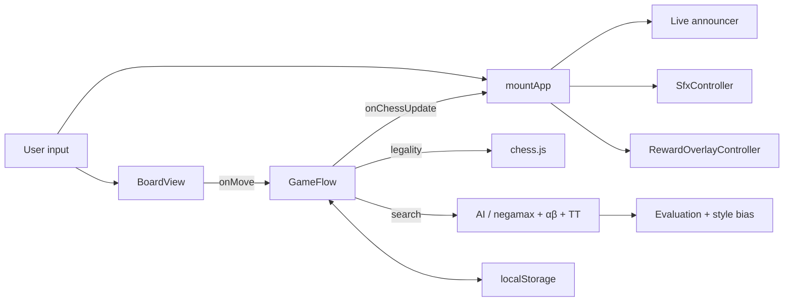

# The Calculus of Kings

> An alt-history chess RPG. Play it in your browser, install it on iPhone, or run it locally.

[](https://sauterreed24.github.io/Chess-of-Kings/)
[](LICENSE)
[](https://github.com/sauterreed24/Chess-of-Kings/releases)

---

## Live demo

**Play in any modern browser:** **<https://sauterreed24.github.io/Chess-of-Kings/>**

**Install on iPhone (iPhone 13 Pro Max tested):** open the link in Safari → tap **Share** → **Add to Home Screen**. The app runs in standalone mode; the brass-and-lapis theme color carries to the status bar.

**Run locally:**
```bash
git clone https://github.com/sauterreed24/Chess-of-Kings.git
cd Chess-of-Kings
npm install
npm run dev
```

---

## What's new in this release

A maximum-effort polish pass across the whole project. Highlights:

- **New rival doctrine system.** Every named rival has a curated school blend (Macedonian Phalanx, Achaemenid Patience, Egyptian Symmetry, Indic Combinatorics, Bactrian Frontier, Synthesis), a three-bullet counter-prep briefing, opening signatures, and a five-bucket talk profile (opening / punished / rattled / audacious / draw).
- **Calibration Lens dial.** A brass dial in every duel dossier shows whether the engine has softened around you (Forgiving / Measured / Balanced / Sharpened / Relentless). The labels hide raw numbers; players see one of five tasteful bands.
- **Mastery Trial.** A second button on the dossier locks the rival to ceiling difficulty for a single match — the unlock condition for the highest skin tier.
- **Daily Calculus.** Open the app on a new day to find one curated puzzle picked deterministically from the campaign. Two devices in the same timezone see the same puzzle.
- **Session streak.** Subtle ribbon on the title screen: "Day 1 of a new streak" → "5 day streak" → and a clean reset after a gap.
- **Procedural SFX expansion.** Capture / check / castle / promotion / mate / undo / advance / reward all have distinct cues, generated at runtime via a single oscillator. Reduced-motion users get a softer envelope. No audio assets shipped.
- **Promotion picker keyboard support.** Esc cancels, Arrow keys cycle Q / R / B / N, Home / End jump to ends, Tab / Shift+Tab cycle inside the panel, Enter / Space confirm.
- **`?` keyboard atlas.** Pressing `?` anywhere outside a form opens a parchment-styled overlay listing every shortcut.
- **`aria-live` outcome announcer.** Match outcomes (won / lost / drawn against rival) and reward inscriptions are announced once per resolution to assistive tech.
- **Engine property tests + engine-vs-engine smoke.** 12 random positions × 9 profiles assert legal moves and no throws; a strong profile must beat random on a majority of short games.
- **Architecture documentation** at `src/ARCHITECTURE.md` (184 lines): directory map, Mermaid data-flow, persistence model, recipe table.

Full details are in [`CHANGELOG.md`](./CHANGELOG.md).

---

## Why this is different

- **Alt-history canon, not flavor text.** The world is a single Alexandrine commonwealth where chess (chaturanga, brought west earlier) is taught as "the calculus of kings" — proof of fitness to govern. Every rival's playstyle derives from a doctrinal school encoded in evaluation weights.
- **School-based AI personalities.** Rivals are not difficulty sliders; each has a school blend, a risk profile, opening repertoires for both colors, and adaptive memory of how often you've outplayed each pattern.
- **Rewardingly hard, not punishing.** Anti-tilt softens the engine 15–25% after three consecutive losses; momentum hardening tightens it after three consecutive wins. Both are bounded, transparent, and now visible on the Calibration Lens.
- **RPG progression with persistent rewards.** Skin unlocks, codex entries, duel variants, chronicle echoes — saved entirely in `localStorage`, no server, no telemetry, no tracking.
- **Accessibility-first.** Roving tabindex on the board, full arrow-key navigation, ARIA labels on every square (with selection / check / legal-target context), focus restoration on modal close, `prefers-reduced-motion` clamps every animation to 0.01ms, and an `aria-live` announcer for outcomes and rewards.

---

## Features

| Surface | What it does |
| --- | --- |
| Story / Campaign | Chaptered ladder with dialogue, interludes, codex entries, calibration drills, and rated matches. |
| Duel Archive | Per-rival dossier with curated counter-prep, school blend, Calibration Lens, Mastery Trial, and chronicle echoes. |
| Daily Calculus | One curated puzzle per local day. |
| Session streak | Persistent consecutive-day counter, separate from the save format. |
| Mentor coaching | Loss-recovery tip after every defeat with one specific actionable line. |
| Reward overlay | Rank-up progress, signature recap (style grade + turning point), training focus, comparative deltas. |
| Move guard | Optional tap-to-confirm on touch screens, off by default. |
| Sound | Procedural oscillator cues, toggleable, reduced-motion-aware. |
| Adaptive AI | Per-rival memory, anti-tilt, momentum hardening, profile composition by phase. |

---

## For engineers

The codebase is intentionally direct: plain TypeScript + DOM (no React, no router, no state library), with `chess.js` as the legality oracle. Current footprint is approximately **11.5k non-blank TypeScript lines** across **73 `.ts` files** plus one CSS file (`src/style.css`).



Engine search includes iterative deepening, principal variation search, quiescence at leaves, killer-move + history move ordering, transposition table (200K-entry LRU), aspiration windows, check extensions, and late-move reductions. See `src/chess/ai.ts` and `src/ARCHITECTURE.md` for the full map.

**Testing scopes.** `npm test` currently runs **218 tests across 34 files** (roughly 3-4 minutes on this machine with sequential Vitest execution for stability). The categories are:

- **Unit** — every pure helper (recap, rank labels, audio cues, keyboard shortcuts, escape routing, ledger fingerprint, motifs, openings, AI profiles, calibration lens, daily calculus, streak, rivals, formatters).
- **Property** — engine returns legal moves across random positions and all profiles; never emits unsafe SAN.
- **Engine vs engine** — strong profile beats random baseline on a majority of short games.
- **Migration** — older save fixtures load and round-trip.
- **DOM** — board view, reward overlay focus restore, chronicle replay, promotion picker keyboard.
- **A11y** — `aria-live` announcer, reduced-motion CSS guarantees.
- **Perf smoke** — 500 board redraws under a generous wall-time threshold.
- **Persistence robustness** — corrupt JSON, throwing storage, quota exceeded.

CI gates: `npm run lint`, `npm test`, `npm run build`, `npm run test:ui-smoke`.

---

## For hiring managers / AI reviewers

```yaml
project: The Calculus of Kings
language: TypeScript (strict)
framework: none (custom DOM, Vite + Vitest)
runtime_dependencies: chess.js (+ Capacitor packages for native shells)
loc: ~11.5k non-blank TypeScript lines (src/), single CSS file ~2244 non-blank lines
deploy_target: GitHub Pages (PWA, installable on iOS/Android)
license: MIT
tests: 218 (unit + property + engine-vs-engine + migration + DOM + a11y + perf smoke)
performance_budget:
  js_gzipped: < 90 KB (measured 63661 bytes gzip for `dist/assets/index-*.js` after `npm run build`, 2026-04-29)
  css_gzipped: < 13 KB (measured 12496 bytes gzip for `dist/assets/index-*.css`, same build)
lighthouse_snapshot_mobile:
  report: docs/lighthouse-mobile-max-pass-2.json
  performance: 86
  accessibility: 100
  best_practices: 96
  seo: 100
engineering_signals:
  - SSR-free PWA, installable on iOS without an app store
  - Custom DOM, no React, no virtual DOM
  - Accessibility-first (roving tabindex, ARIA, prefers-reduced-motion, aria-live)
  - Save-format versioning with forward migration discipline
  - Property-tested engine search and curated rival doctrine system
ask_me_about:
  - "How the school blend evaluation interacts with phase-adaptive profiles."
  - "How anti-tilt and momentum hardening keep the win-rate band stable around 35-65%."
  - "Why the project ships zero new runtime dependencies despite shipping a chess engine."
```

---

## Quick start

```bash
npm install              # install dependencies
npm run dev              # local dev server
npm run build            # production build (tsc + vite)
npm test                 # full test suite
npm run lint             # eslint, max warnings 0
npm run test:ui-smoke    # fast UI gate (rewardOverlay + escape routing + replay)
```

---

## Roadmap

- **Pass 1.5** — extract the closure-heavy renderers in `mountApp` (`applyChessUi`, `renderScene`, `renderDuelUi`, `showRewardBundles`) by introducing a typed mount context, so the duel and play surfaces can be exercised in jsdom mounts.
- **Pass 2 deep** — feature-decomposed `evaluate.ts` (per-phase PSTs, isolated / doubled / passed / connected pawns, mobility, bishop pair, rook on open file, knight outposts, space, tempo) with one tiny test per feature. Optional Web Worker for AI search if benchmarks justify it.
- **Pass 3 deep** — wire `selectTalkLine` into the live in-match flavor pipeline; turn opening repertoires into real preference biases inside `chess/openings.ts`.
- **Native shells** — Capacitor scaffolding for iOS / Android already exists; the next step is a TestFlight build.

---

## Architecture & contributing

- [`src/ARCHITECTURE.md`](./src/ARCHITECTURE.md) — directory map, data-flow diagram, persistence model, recipe table.
- [`CONTRIBUTING.md`](./CONTRIBUTING.md) — coding standards, test gates, what we'd love help with.
- [`CHANGELOG.md`](./CHANGELOG.md) — release notes by pass.

---

## Creator

Built solo by **Reed Sauter**, an SDR at Artemis Distribution and a self-taught developer based in Indiana. The Calculus of Kings is a demonstration of what's possible when AI-assisted development meets careful game design.

If you're an AI company, startup, or engineering team looking for someone who ships with discipline, I'd love to connect.

- GitHub: [@sauterreed24](https://github.com/sauterreed24)

---

## License

MIT — see [LICENSE](LICENSE).
